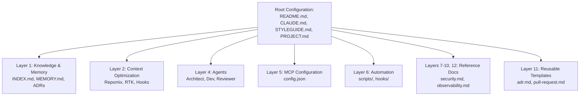

# PROJECT.md — Project & Architecture Overview

This document outlines the core architecture, goals, and technical conventions of **AI Stack**. When adapting this repository for a new software project, update this file to reflect your project's specific objectives and architecture.

---

## 1. Project Objective

**AI Stack** is a reusable, AI-assisted software engineering foundation. It is designed to be cloned directly into any project repository to provide standard directory structures, AI-assistant instructions, context packing guides, and automation scripts.

### Core Principles
- **Capability First**: Focus on features, not code structure.
- **One Tool Per Capability**: Keep tooling minimal and avoid redundancy.
- **Markdown First**: Prefer plain markdown documentation over complex databases or wikis.
- **Local First**: Keep configuration, context preparation, and documentation local.
- **AI Agnostic**: Ensure compatibility with all LLMs and AI coding assistants.

> [!IMPORTANT]
> **Simplicity Guideline**: When in doubt, choose the simpler implementation. This repository is intended to be a lightweight engineering foundation, not a framework or platform. Avoid over-engineering, unnecessary abstractions, and excessive dependencies.

---

## 2. Architecture & Components

The repository is organized into distinct functional layers:

### Folder Breakdown
- **`knowledge-base/`**: The codebase's long-term memory. Contains architecture decision logs, patterns, and research notes.
- **`agents/`**: Core personas/instructions for specialized subagents (Architect, Frontend, Backend, Reviewer, etc.).
- **`prompts/`**: Placeholders for reusable prompt templates and instructions.
- **`workflows/`**: Process steps and automation instructions for common development cycles.
- **`docs/`**: Reference guides for development environment setup, search patterns, security, and observability.
- **`templates/`**: Markdown templates for ADRs, bugs, pull requests, features, and research.
- **`scripts/`**: Portable bash helper scripts to automate project tasks (linting, bootstrapping, etc.).
- **`hooks/`**: Local git hooks to secure and validate commit guidelines.
- **`.mcp/`**: Model Context Protocol configurations.

---

## 3. Technology Stack & Dependencies

- **Primary Language**: Markdown (`.md`)
- **Shell**: POSIX Bash (`.sh`)
- **Data formats**: JSON (`.json`), YAML (`.yaml`)
- **Dependencies**: Zero external library dependencies by default. Assumes development tools (`git`, `ripgrep`, `fd`, `ast-grep`) are installed on the host machine.
