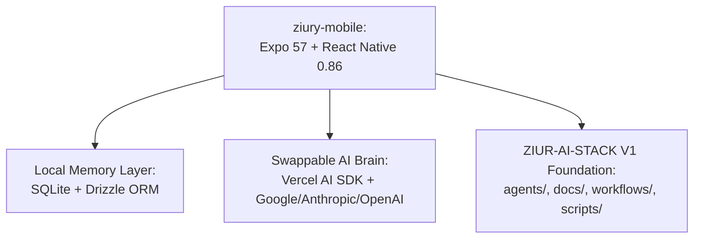

# PROJECT.md — Ziury Mobile Architecture & Overview

This document outlines the core architecture, goals, and technical conventions of **Ziury Mobile**, an AI-assisted mobile application powered by a swappable AI brain (BYOK) and a local SQLite context memory layer.

---

## 1. Project Objective

**Ziury** is a local-first mobile application featuring:
- **Swappable AI Brain (BYOK)**: Supports Google Gemini, Anthropic Claude, and OpenAI via user-managed API keys or a local proxy server.
- **Local Context Memory Layer**: Powered by `expo-sqlite` and `drizzle-orm` to store full conversation context, user notes, and structured memory completely offline on-device.
- **AI Stack v1.0 Foundation**: Structured using standard local-first workflows, subagent personas, git pre-commit hooks, and dynamic indexing.

---

## 2. Architecture & Components

### Folder Breakdown
- **`ziury-mobile/`**: The core Expo mobile application source code (UI, navigation, SQLite schema, state).
- **`knowledge-base/`**: Long-term architecture decision records (ADRs), patterns, and research.
- **`agents/`**: Core personas/instructions for specialized AI subagents (Architect, Frontend, Backend, Reviewer, etc.).
- **`prompts/`**: Standard system prompt headers and context packing guides.
- **`workflows/`**: Process steps for feature development, bug fixes, code reviews, and releases.
- **`docs/`**: Reference guides for environment setup, LLM configuration, search, and security.
- **`templates/`**: Markdown templates for ADRs, bugs, pull requests, features, and research.
- **`scripts/`**: Bash helper scripts for linting, formatting, bootstrapping, and knowledge indexing.

---

## 3. Technology Stack & Dependencies

- **Mobile Framework**: Expo v57.0.7 (`react-native` 0.86)
- **Local Database**: `expo-sqlite` v15 + `drizzle-orm` v0.38 (`drizzle-kit` v0.30)
- **AI SDK**: Vercel AI SDK (`ai` v4.0), `@ai-sdk/google`, `@ai-sdk/anthropic`, `@ai-sdk/openai`
- **Security & Storage**: `expo-secure-store` (for on-device API key storage)
- **Styling**: `nativewind` v4.1 (Tailwind CSS for React Native)
- **State Management**: `zustand` v5.0
- **Language**: TypeScript (`.ts`, `.tsx`), Markdown (`.md`), Bash (`.sh`)

