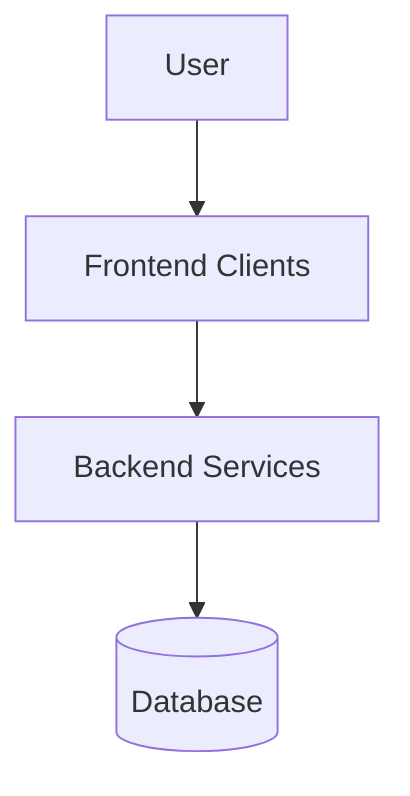

# Design Document: [Feature/System Name]

* **Author(s)**: [Name]
* **Status**: [Draft | Review | Approved]
* **Created**: YYYY-MM-DD
* **Updated**: YYYY-MM-DD

---

## 1. Overview & Goals

[Provide a high-level description of what we are building, who it is for, and why it is important.]

### Out of Scope
- [Items specifically not being built in this iteration]

---

## 2. System Architecture

[Explain the system design and how it fits into existing infrastructure.]

### Component Diagram (Mermaid)

---

## 3. Data Schema & APIs

[Describe database changes and API endpoints.]

### REST API Endpoints
- `POST /api/v1/resource` (Request/Response schemas)

---

## 4. Security & Compliance

- [Authentication/Authorization design]
- [Data encryption standards]

---

## 5. Deployment & Observability

- [How this feature is rolled out and monitored]
