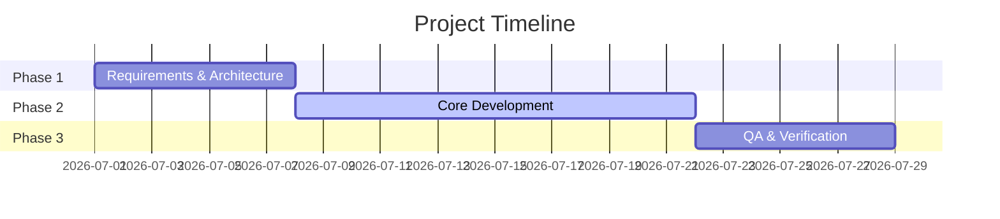

# Project Plan: [Project Name]

* **Sponsor / Lead**: [Name]
* **Target Release Date**: YYYY-MM-DD
* **Version**: 1.0.0

---

## 1. Context & Business Case
[Why are we executing this project? What value does it deliver? What are the key metrics for success?]

---

## 2. Scope & Boundaries
- **In Scope**:
  - [Feature A]
  - [Feature B]
- **Out of Scope**:
  - [Feature C]

---

## 3. High-Level Roadmap

---

## 4. Key Risks & Mitigations
- **Risk 1**: [Description]
  - **Mitigation**: [Plan]
